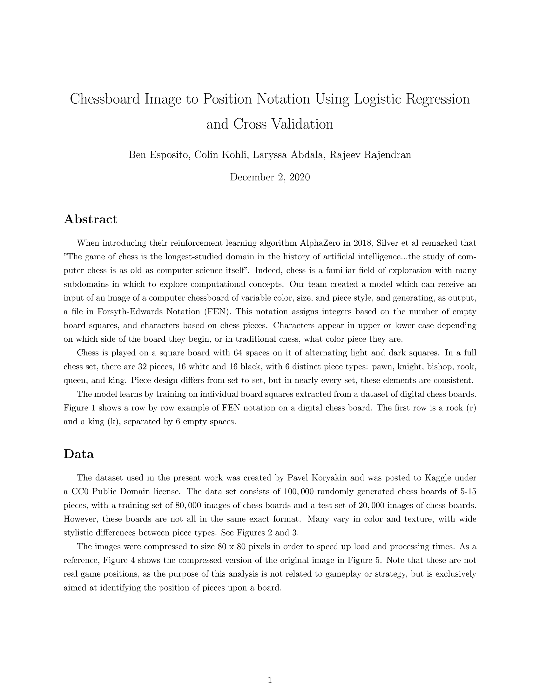
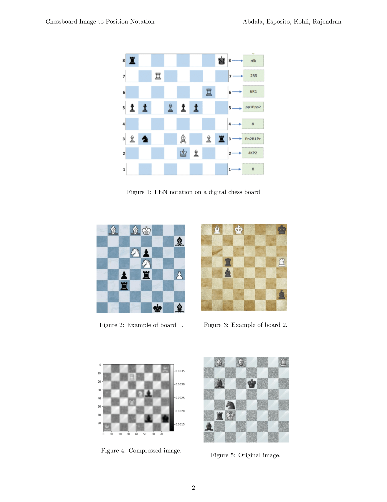
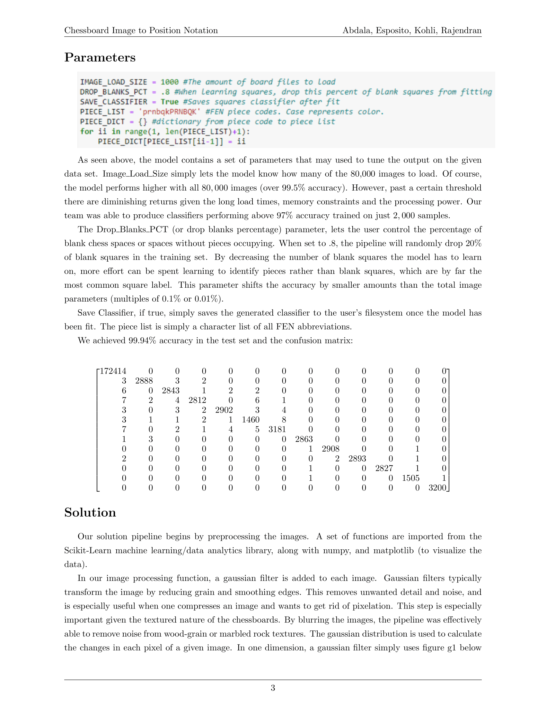
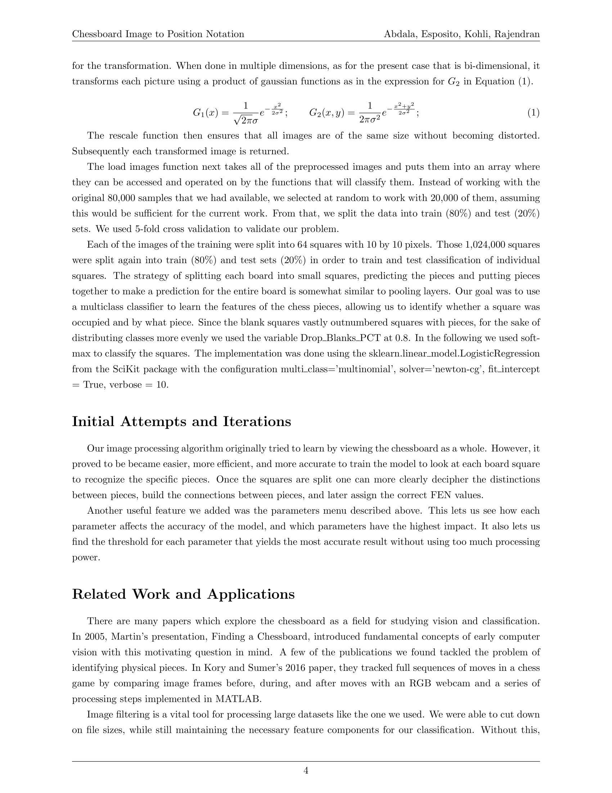
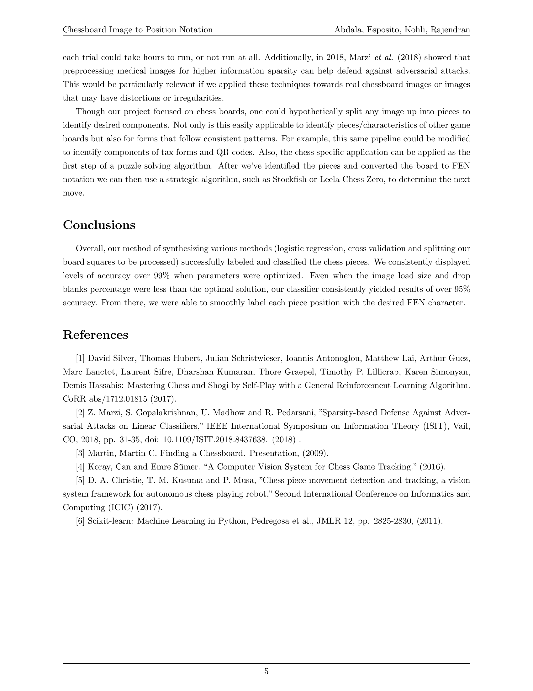

# chess-regression
A pipeline for learning chess positions based on images of chessboards. Includes best classifier, trained on 20,000 images which achieves 99.94% accuracy on a validation set. 

